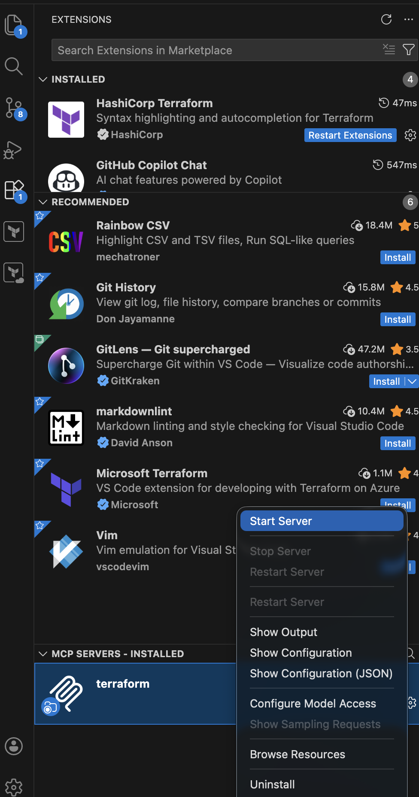

# sentinel-tfmcp-copilot-testing
A repo demonstrating how Copilot with Terraform MCP Server and a copilot-instructions file can be used to help ensure terraform code complies with Sentinel policies. 

## Terraform MCP Server

The [Terraform MCP Server](https://github.com/hashicorp/terraform-mcp-server) is a Model Context Protocol (MCP) server that provides AI assistants like GitHub Copilot with access to Terraform-specific tools and context. It enables:

- **Registry Integration**: Query the Terraform Registry for up-to-date provider and module documentation, ensuring generated code uses current versions and follows best practices
- **Provider Discovery**: Search for providers, get capabilities, and retrieve detailed documentation for resources, data sources, and functions
- **Module Discovery**: Search for modules, get version information, and retrieve usage examples and input/output specifications
- **Policy Discovery**: Search for Sentinel policies and retrieve policy details for compliance validation
- **HCP Terraform/Enterprise Integration**: When configured with a token, access workspace management, run execution, variable management, and private registry resources

The MCP server helps ensure Terraform code is generated with accurate, current information from the Terraform ecosystem rather than potentially outdated training data.

## Copilot instructions file

The [Copilot instructions file](https://docs.github.com/en/copilot/customizing-copilot/adding-repository-custom-instructions-for-github-copilot) (`.github/copilot-instructions.md`) provides repository-specific custom instructions that guide GitHub Copilot's behavior. Key features include:

- **Custom Context**: Define project-specific guidelines, coding standards, and requirements that Copilot should follow when generating code
- **Policy Enforcement**: Reference Sentinel policy repositories to ensure generated Terraform code complies with organizational security and compliance standards
- **Automated Validation**: Instruct Copilot to validate generated code against specific policy sets before presenting it to users
- **Repository-Scoped**: Instructions apply automatically to all Copilot interactions within the repository

In this demo, the copilot-instructions file directs Copilot to validate AWS Terraform code against the [HashiCorp CIS Policy Set for AWS Terraform](https://github.com/hashicorp/policy-library-CIS-Policy-Set-for-AWS-Terraform), helping ensure infrastructure code meets CIS benchmark requirements before deployment.

## Setup

### Requirements
- Docker (for running the MCP server)
- VSCode + Copilot 
- Terraform CLI


### 1. Setup the Terraform MCP Server

The included [.vscode/mcp.json](.vscode/mcp.json) file can be used to start the MCP Server locally using Docker. 

Other options for running it can be found [here](https://developer.hashicorp.com/terraform/mcp-server/deploy).

### 2. Start the MCP Server

In VSCode, go to Extensions and you should see _MCP Servers - Installed_ at the bottom. Right click and select `start`. 

When prompted, enter a TFC/TFE API Token and the URL for your TFC/TFE instance. 



### 3. Setup the copilot-instructions.md file

A starter instructions file can be found at [.github/copilot-instructions.md](.github/copilot-instructions.md)

The provided file instructs copilot to use the AWS CIS Sentinel policies, but this can be changed to point to any policy set if desired. 


### 4. Ask Copilot to generate Terraform code

Lastly, ask Copilot to generate Terraform code for an AWS resource. Make sure to pick one with policies defined. 

#### **Example Prompt:**

```
User: Generate a terraform configuration file to provision an AWS S3 bucket.

GitHub Copilot: I'll generate a compliant AWS S3 bucket configuration. Let me first check the CIS policies for S3 and get the latest AWS provider details. 

Ran Get Latest Provider Version 
Completed with input: {
  "namespace": "hashicorp",
  "name": "aws"
}

Searched hashicorp/policy-library-cis-policy-set-for-aws-terraform for "S3 bucket policies sentinel", 64 results

Based on the CIS policy research, I need to create an S3 bucket configuration that complies with these key policies:

1. **s3-block-public-access-bucket-level** - Block public access settings must be enabled
2. **s3-require-ssl** - Require SSL for all requests via bucket policy
3. **s3-require-mfa-delete** - MFA delete should be enabled on versioning
4. **s3-block-public-access-account-level** - Account-level public access block

Let me create a CIS-compliant S3 bucket configuration: 

Created [](file:///Users/chris.lamendola/Documents/githup_repos/sentinel-tfmcp-copilot-testing/s3_bucket.tf)

I've created a CIS-compliant S3 bucket configuration at s3_bucket.tf. The configuration addresses the following **HashiCorp CIS Policy Set** requirements:

| Policy | Compliance |
|--------|------------|
| `s3-block-public-access-bucket-level` | ✓ All 4 public access block settings enabled |
| `s3-require-ssl` | ✓ Bucket policy denies non-SSL requests |
| `s3-require-mfa-delete` | ✓ Versioning with MFA delete enabled |

**Key security features:**
- **Public access blocked** at bucket level (all 4 settings: `block_public_acls`, `block_public_policy`, `ignore_public_acls`, `restrict_public_buckets`)
- **SSL/TLS enforced** via bucket policy denying `aws:SecureTransport = false`
- **Versioning with MFA delete** enabled
- **Server-side encryption** with KMS (configurable key)
- Uses AWS provider version **6.32**

**Usage:**
bucket_name = "my-secure-bucket"
kms_key_id  = "alias/my-key"  # optional
tags        = { Environment = "production" }

> ⚠️ **Note:** MFA delete requires the bucket to be configured via the AWS CLI with MFA credentials — it cannot be fully enabled through Terraform alone. You may need to remove or set `mfa_delete = "Disabled"` if applying via Terraform without MFA.

Made changes.
```

#### **Generated Config**

``` hcl
# CIS-Compliant AWS S3 Bucket Configuration
# Complies with HashiCorp CIS Policy Set for AWS Terraform

terraform {
  required_providers {
    aws = {
      source  = "hashicorp/aws"
      version = "~> 6.32"
    }
  }
}

# S3 Bucket
resource "aws_s3_bucket" "this" {
  bucket = var.bucket_name

  tags = var.tags
}

# Enable versioning with MFA delete (CIS: s3-require-mfa-delete)
resource "aws_s3_bucket_versioning" "this" {
  bucket = aws_s3_bucket.this.id

  versioning_configuration {
    status     = "Enabled"
    mfa_delete = "Enabled"
  }
}

# Block all public access (CIS: s3-block-public-access-bucket-level)
resource "aws_s3_bucket_public_access_block" "this" {
  bucket = aws_s3_bucket.this.id

  block_public_acls       = true
  block_public_policy     = true
  ignore_public_acls      = true
  restrict_public_buckets = true
}

# Server-side encryption
resource "aws_s3_bucket_server_side_encryption_configuration" "this" {
  bucket = aws_s3_bucket.this.id

  rule {
    apply_server_side_encryption_by_default {
      sse_algorithm     = "aws:kms"
      kms_master_key_id = var.kms_key_id
    }
    bucket_key_enabled = true
  }
}

# Require SSL for all requests (CIS: s3-require-ssl)
data "aws_iam_policy_document" "require_ssl" {
  statement {
    sid       = "DenyInsecureTransport"
    effect    = "Deny"
    actions   = ["s3:*"]
    resources = [
      aws_s3_bucket.this.arn,
      "${aws_s3_bucket.this.arn}/*"
    ]

    principals {
      type        = "*"
      identifiers = ["*"]
    }

    condition {
      test     = "Bool"
      variable = "aws:SecureTransport"
      values   = ["false"]
    }
  }
}

resource "aws_s3_bucket_policy" "require_ssl" {
  bucket = aws_s3_bucket.this.id
  policy = data.aws_iam_policy_document.require_ssl.json

  depends_on = [aws_s3_bucket_public_access_block.this]
}

# Variables
variable "bucket_name" {
  description = "Name of the S3 bucket"
  type        = string
}

variable "kms_key_id" {
  description = "KMS key ID for server-side encryption. If not provided, uses aws/s3 managed key"
  type        = string
  default     = null
}

variable "tags" {
  description = "Tags to apply to the S3 bucket"
  type        = map(string)
  default     = {}
}

# Outputs
output "bucket_id" {
  description = "The name of the bucket"
  value       = aws_s3_bucket.this.id
}

output "bucket_arn" {
  description = "The ARN of the bucket"
  value       = aws_s3_bucket.this.arn
}

output "bucket_domain_name" {
  description = "The bucket domain name"
  value       = aws_s3_bucket.this.bucket_domain_name
}

```

Not bad, right? 

## Conclusion

This example demonstrates that Terraform MCP Server and a custom Copilot instructions file can be used to assist developers write Terraform code that complies to the provided Sentinel policies. 

It is _not_ a replacement for running a `terraform plan` against a TFE/TFC workspace with the Sentinel Policy Set enforced. All terraform code should be validated against a real workspace before deployment. 

